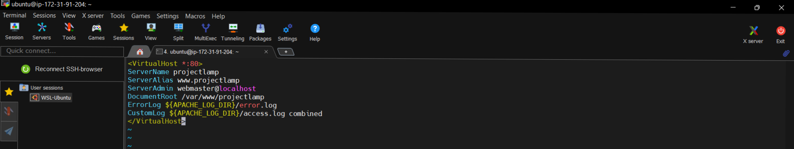
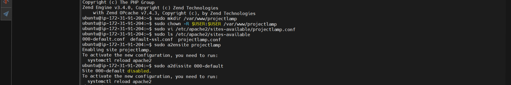
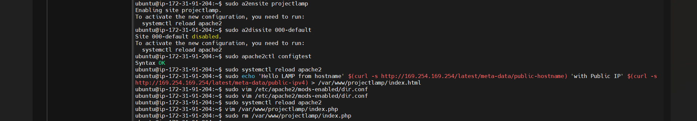
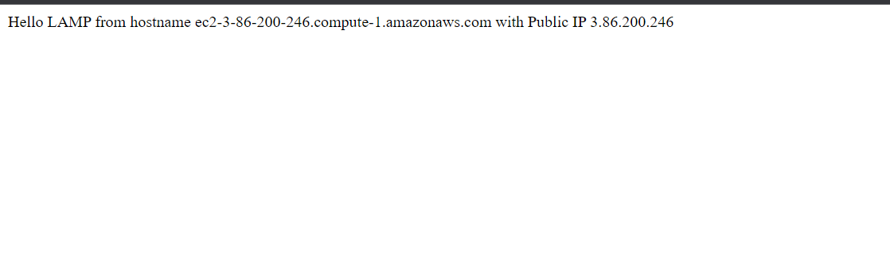
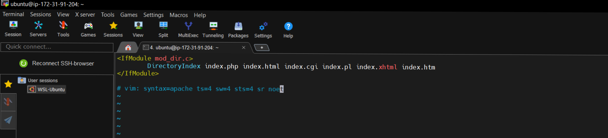
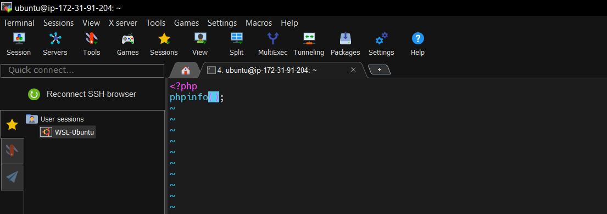
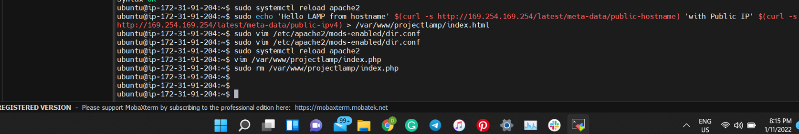

# Project 1

**Installing Apache and Updating the Firewall** 
___

updating a list of packages in package manager

`$ sudo apt update`

running apache2 package installation

`$ sudo apt install apache2`

verifing that apache2 is running as a service in my OS

`$ sudo systemctl status apache2`

opening TCP port 80 in the EC2 instance

accessing apache2 locally

`$ curl http://localhost:80`

retrieving public IP address locally

`$ curl -s http://169.254.169.254/latest/meta-data/public-ipv4`

test that apache server is up and running using http://3.86.200.246

**Installing MySQL**

installing mysql in the server

`$ sudo apt install mysql-server`

securing sql installation

` $ sudo mysql_secure_installation`

logging into mysql server

` $ sudo mysql`

**Installing PHP**

installing 3 PHP packages - *PHP, Libapache2-mod-php & Php-mysql*

` $ sudo apt install php libapache2-mod-php php-mysql`

confirming php version

` $ php -v`

**LAMP Stack is installed and operational**

### Creating a virtual host for my website using Apache2

creating a directory for projectlamp

` $ sudo mkdir /var/www/projectlamp`

assigning ownership of the directory with my current system user

` $  sudo chown -R $USER:$USER /var/www/projectlamp`

Creating and opening a new configuration file in Apache’s sites-available directory using "vi" command-line editor

` $ sudo vi /etc/apache2/sites-available/projectlamp.conf`

entering bare-bones configuration by hitting on i on the keyboard to get into the insert mode, and pasted the texts:

showing the new file in the sites-available directory

`$ sudo ls /etc/apache2/sites-available`

enabling the new virtual host

`$ sudo a2ensite projectlamp`

disabling the default website that comes installed with Apache

` $ sudo a2dissite 000-default`

testing to make sure configuration file does not contain syntax error

`$ sudo apache2ctl configtest`

reloading Apache so changes made can take effect

`$ sudo systemctl reload apache2`

Creating an index.html file in the /var/www/projectlamp location to test if the virtual host works

`sudo echo 'Hello LAMP from hostname' $(curl -s http://169.254.169.254/latest/meta-data/public-hostname) 'with public IP' $(curl -s http://169.254.169.254/latest/meta-data/public-ipv4) > /var/www/projectlamp/index.html`

proof that it's working

**Enabling PHP on the Website**

editing the /etc/apache2/mods-enabled/dir.conf file and changing the order in which the index.php file is listed within the DirectoryIndex directive to make the php page the landing page

`$ sudo vim /etc/apache2/mods-enabled/dir.conf`

Creating a new file named index.php inside the custom web root folder

`$ vim /var/www/projectlamp/index.php`

reloading Apache to effect change

`$ sudo systemctl reload apache2`

output to show that PHP installation is working

