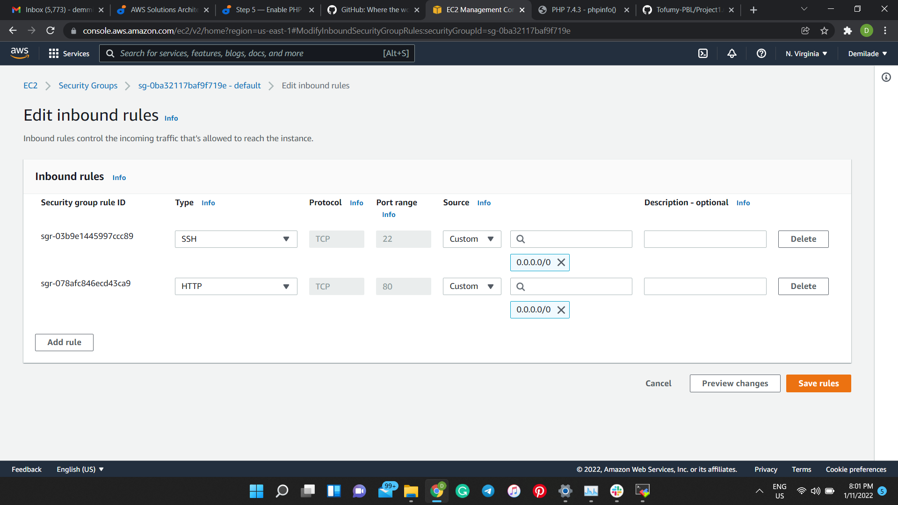

# Project 1

**Installing Apache and Updating the Firewall** 
___

updating a list of packages in package manager

`$ sudo apt update`

running apache2 package installation

`$ sudo apt install apache2`

verifing that apache2 is running as a service in my OS

`$ sudo systemctl status apache2`

opening TCP port 80 in the EC2 instance

accessing apache2 locally

`$ curl http://localhost:80`

retrieving public IP address locally

`$ curl -s http://169.254.169.254/latest/meta-data/public-ipv4`

test that apache server is up and running using http://3.86.200.246

**Installing MySQL**

installing mysql in the server

`$ sudo apt install mysql-server`

securing sql installation

` $ sudo mysql_secure_installation`

logging into mysql server

` $ sudo mysql`

**Installing PHP**

installing 3 PHP packages - *PHP, Libapache2-mod-php & Php-mysql*

` $ sudo apt install php libapache2-mod-php php-mysql`

confirming php version

` $ php -v`

**LAMP Stack is installed and operational**

### Creating a virtual host for my website using Apache2

creating a directory for projectlamp

` $ sudo mkdir /var/www/projectlamp`

assigning ownership of the directory with my current system user

` $  sudo chown -R $USER:$USER /var/www/projectlamp`

